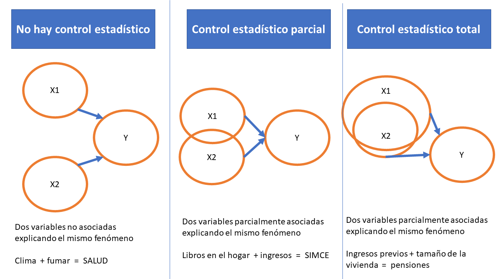
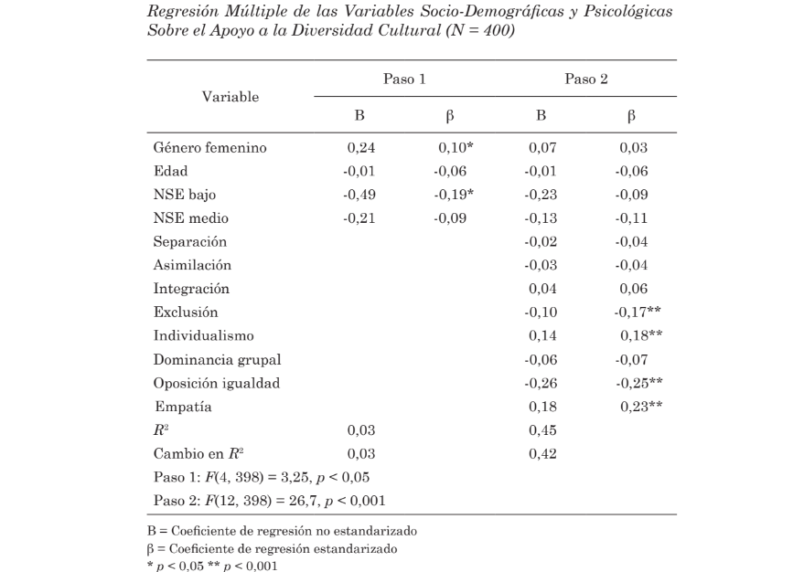
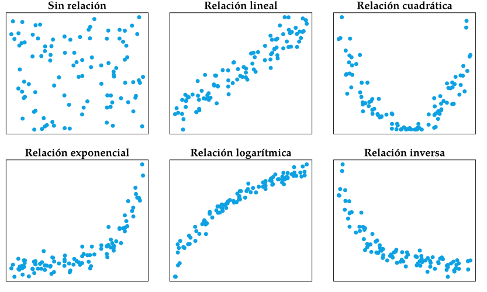
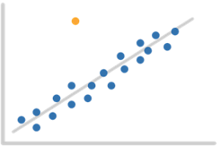

class: inverse, bottom, right

```{r, include=FALSE,echo=FALSE,results='hide'}
#install.packages("pagedown")
#pagedown::chrome_print("cuarta_catedra.html",output="cuarta_catedra.pdf")
```


```{r setup, include=FALSE, cache = FALSE}

library(dplyr)
require("knitr")
options(htmltools.dir.version = FALSE)
pacman::p_load(RefManageR)
knitr::opts_chunk$set(
  echo = FALSE,   # oculta el código
  message = FALSE, 
  warning = FALSE
)
```

```{r eval=FALSE, echo=FALSE}
# Correr esta línea para ejecutar
rmarkdown::render('xaringan::moon_reader')
```

<!---
About macros.js: permite escalar las imágenes como [:scale 50%](path to image), hay si que grabar ese archivo js en el directorio.
.pull-left[<images/Conocimiento cívico.png>] 
.pull-right[<images/Conocimiento cívico_graf.png>]

--->

# _Doceava Clase Social Data Science_
## *Profundizando en las regresiones: beta estandarizado y supuestos de aplicación*
<br>
<hr>
### Docentes: Anais Herrera - Francisco Meneses
### Ayudante: Ignacia Silva

---

## 🧮 Regresiones múltiples: más allá de los coeficientes

**Objetivo de la clase**

> ¿Cómo sabemos qué variable importa más en una regresión, y cuándo podemos confiar en ese resultado?

<br> 

Para responder estas preguntas necesitamos:

- Comprender el sentido de **estandarizar variables**.

- Interpretar **betas estandarizados**.
    + En miras de poder comparar la magnitud del efecto de diferentes variables independientes

- Comprender las condiciones de aplicación de una regresión.


---
class: inverse, middle, center

# Repaso de control estadístico 
## ¿Cuándo debería existir control? 

---

<br>




---
class: inverse, middle, center

# Estandarizar y beta estandarizado


---

# Motivación

* Al tener predictores con distintas escalas la comparación de qué afecta más se hace difícil. 
 
El efecto en PAES de:
  + Efecto de cada peso ($\beta_1 = 0.001$)
  + Efecto de cada hora de estudio diaria ($\beta_2 = 0.6$)


Los $\beta$  de pesos se multiplican por miles o millones, y las horas no superan las decenas. Esto distorsiona la comparación.


---

## 1️⃣ Estandarizar variables

### ¿Qué significa estandarizar?

Transformar una variable para que tenga:

- **Media = 0**
- **Desviación estándar = 1**

$$
Z_i = \frac{X_i - \bar{X}}{s_X}
$$

Permite comparar variables **en diferentes escalas** (ejemplo: puntaje en una prueba, edad, ingreso).

El puntaje de un sujeto pasa de 400 puntos SIMCE a +1.5 desviaciones estándar sobre la media  

o de 250 puntos a -0.2 desviaciones estándar bajo la media


---

# Ejemplo 1: Variable ingresos

.pull-left[

```{r, echo=FALSE}
options(scipen = 999)

library(readxl)
Casen_2017_mini <- read_excel("input/Casen_2017_mini.xlsx")

Casen_2017_mini = Casen_2017_mini %>% na.omit()

Casen_2017_mini$ingresos = Casen_2017_mini$yaut

Casen_2017_mini =  Casen_2017_mini %>% filter(ingresos<3000000)

hist(Casen_2017_mini$ingresos, main="Histograma de ingresos", xlab = "Ingresos", ylab = "Frecuencia")

```


]

.pull-right[

El promedio de los ingresos es `r  paste0("$",round(mean(Casen_2017_mini$ingresos),0))  `

La desviación estándar es `r  paste0("$",round(sd(Casen_2017_mini$ingresos),0))  `


.small[

Los primeros 5 valores

```{r, echo=FALSE}
head(Casen_2017_mini$ingresos) %>% as.matrix()
```

]

]

---

# Ejemplo 1: Estandarizar ingresos 


```{r echo = TRUE}
# Cálculo en R 

Casen_2017_mini$ingresos_estandarizados = 
(
  Casen_2017_mini$ingresos - 
  mean(Casen_2017_mini$ingresos)  
) / 
  sd(Casen_2017_mini$ingresos)  

# O en simple

Casen_2017_mini$ingresos_estandarizados = 
  scale(Casen_2017_mini$ingresos)

```


---

# Ejemplo 1: Ingresos estandarizados 

.small[


```{r}
# Calculo en R 

Casen_2017_mini$ingresos_estandarizados = 
(
  Casen_2017_mini$ingresos - 
  mean(Casen_2017_mini$ingresos)  
) / 
  sd(Casen_2017_mini$ingresos)  

# o en simple

Casen_2017_mini$ingresos_estandarizados = scale(Casen_2017_mini$ingresos)

```


]


.pull-left[

```{r , echo=FALSE}
options(scipen = 999)

library(readxl)


hist(Casen_2017_mini$ingresos_estandarizados, main="Histograma de ingresos estandarizados", xlab = "Ingresos estandarizados", ylab = "Frecuencia")

```


]

.pull-right[

El promedio de los ingresos es `r  paste0("$",round(mean(Casen_2017_mini$ingresos_estandarizados),0))  `

La desviación estándar es `r  paste0("$",round(sd(Casen_2017_mini$ingresos_estandarizados),0))  `


.small[

Los primeros 5 valores

```{r, echo=FALSE}
head(Casen_2017_mini$ingresos_estandarizados) %>% as.matrix()
```

]

]

---

## Comparación caso a caso de ingresos


```{r, echo=FALSE}
head(Casen_2017_mini %>% select(ingresos, ingresos_estandarizados)) %>% kableExtra::kbl()
```

* Valores de ingreso por debajo la media (`r  paste0("$",round(mean(Casen_2017_mini$ingresos),0))  `) quedan como negativos.
* Valores sobre la media quedan como positivos. 
* Todos los valores quedan en unidades de desviación estándar. 

Lea el primer valor señalando cuantas DE se aleja el ingreso de la media. 

---


# Ejemplo 2: Variable edad

.pull-left[

```{r, echo=FALSE}
options(scipen = 999)

hist(Casen_2017_mini$edad, main="Histograma de edad", xlab = "Edad", ylab = "Frecuencia")

```


]

.pull-right[

El promedio de la edad es `r  paste0(round(mean(Casen_2017_mini$edad),0))  `

La desviación estándar es `r  paste0(round(sd(Casen_2017_mini$edad),0))  `

.small[

Los primeros 5 valores

```{r, echo=FALSE}
head(Casen_2017_mini$edad) %>% as.matrix()
```

]


]

---

# Ejemplo 2:  Estandarizar edad


```{r echo = TRUE}
# Cálculo en R 

Casen_2017_mini$edad_estandarizada = 
(
  Casen_2017_mini$edad - 
  mean(Casen_2017_mini$edad)  
) / 
  sd(Casen_2017_mini$edad)  

# O más simple

Casen_2017_mini$edad_estandarizada = 
  scale(Casen_2017_mini$edad)

```


---

# Ejemplo 2: Edad estandarizada


.pull-left[

```{r hist_edad, echo=FALSE}
options(scipen = 999)
library(readxl)

hist(Casen_2017_mini$edad_estandarizada, main="Histograma de edad estandarizada", xlab = "Edad estandarizada", ylab = "Frecuencia")

```


]

.pull-right[

El promedio de los ingresos es `r  paste0(round(mean(Casen_2017_mini$edad_estandarizada),0))  `

La desviación estándar es `r  paste0(round(sd(Casen_2017_mini$edad_estandarizada),0))  `


.small[

Los primeros 5 valores

```{r, echo=FALSE}
head(Casen_2017_mini$edad_estandarizada) %>% as.matrix()
```

]


]


---

# Comparación caso a caso de edad


```{r, echo=FALSE}
head(Casen_2017_mini %>% select(edad, edad_estandarizada)) %>% kableExtra::kbl()
```

* Valores de ingreso por debajo la media (`r  paste0(round(mean(Casen_2017_mini$edad),0))  `) quedan como negativos.
* Valores sobre la media quedan como positivos. 
* Todos los valores quedan en unidades de desviación estándar. 

Lea el primer valor señalando cuantas DE se aleja la edad de la media. 

---

### ¿Por qué estandarizar para hacer regresiones?

- 🔄 **Comparabilidad:** permite interpretar efectos en unidades equivalentes.

- ⚖️ **Magnitud relativa:** ayuda a ver qué predictor tiene mayor peso.

- 🚫 **No cambia la relación estadística** (solo cambia la escala).

---

# 2️⃣ Betas estandarizados (β*)

### Regresión lineal múltiple

$$
Y = b_0 + b_1 X_1 + b_2 X_2 + \varepsilon
$$

Cuando las variables están estandarizadas:

$$
Z_Y = \beta_1 Z_X1 + \beta_2 Z_X2 + \varepsilon 
$$


→ Cada **β estandarizado** indica el cambio en **desviaciones estándar de Y**
ante un cambio de **una desviación estándar en X**, controlando las demás variables.

---

### Interpretación práctica: Efectos sobre PAES

| Variable | β estandarizado | Interpretación |
|-----------|-----------------|----------------|
| Horas de estudio (HE) | 0.45*** | Por DE que aumenta HE, aumenta el rendimiento  en 0.45 DE. |
| Estrés | -0.32*** | Por DE que aumenta el estrés, disminuye el rendimiento  en -0.32 DE. |
| Apoyo docente | 0.20*** | Más apoyo → mejor desempeño. |
Nota: *** p < 0.001

→ Permite comparar la **importancia relativa** de los predictores.

¿Cúal variable es más relevante?

---

.center[


]

---
class: inverse, middle, center

# ¿Qué son los supuestos de aplicación?
## O condiciones de validez del análisis

---

## Regresiones múltiples: más allá de los coeficientes

***Definición de supuestos***

Refieren a las condiciones en las cuales se pueden utilizar adecuadamente los resultados de una regresión.  

Al estimar una regresión se debe defender con evidencia que no se rompen estos supuestos. 

Se pueden generar análisis para corroborar algunos.  


---

### Sobre la muestra 

Para garantizar la validez externa y la posibilidad de extrapolar los resultados se suele necesitar: 

  * La muestra debe ser aleatoria para garantizar representatividad.
  * Se suele considerar un mínimo de 30 casos por predictor (es decir, por variable independiente).
  * Muestras más ruidosas (con más dispersión en sus resultados) requieren muestras más grandes.

.pull-left[
.small[
> Se puede estimar el n mínimo necesario. En este caso cuánto N necesitamos para predecir una variable con un $R2$ de 10% 3 predictores (Con un 95% de confianza). Según el código se requiere 103 casos. 

]

]

.pull-right[
.small[

```{r echo=TRUE, eval=FALSE, message=FALSE, warning=FALSE}
#install.packages("pwrss")
library(pwrss)
power.f.regression(r.squared = 0.10, # R2 que se espera según literatura. 
                   k.total = 3, # número de predictores
                   power = 0.80,
                   alpha = 0.05,)

```

]

]

---
### Sobre la muestra

.small[

```{r eval=TRUE, message=FALSE, warning=FALSE}
#install.packages("pwrss")
library(pwrss)
pwrss::power.f.regression(r.squared = 0.10, # R2 que se espera según literatura. 
                   k.total = 3, # número de predictores
                   power = 0.80,
                   alpha = 0.05,)

```

]

---

## Linealidad de la relación

Las regresiones lineales suponen que la mejor forma de representar la relación entre dos continuas es una recta. 

  * Es necesario evaluar visualmente la relación  _sjPlot::plot_scatter(datos, x ,y, line="auto")_
  * Se pueden incorporar explícitamente parámetros no lineales al modelo
  * Las variables ingresadas como categóricas están menos afectadas por este supuesto

.center[


]

---

.pull-left[

```{r, echo=FALSE}
set.seed(123)

# Variable independiente
x <- seq(0, 10, length.out = 200)

# Relación cuadrática creciente con ruido
y <- 5*x - 0.5*x^2 + rnorm(200, 0, 2)

# Aplicamos meseta (no crece más allá de 20)
y <- pmin(y, 20)

datos <- data.frame(x, y)

datos = datos %>%  filter(x < 6)

```

.small[

```{r, results='asis'}

# Ajustamos modelo cuadrático
modelo_quad <- lm(y ~ x + I(x^2), data = datos )
stargazer::stargazer(modelo_quad,type="html")

```
]

]


.pull-right[


```{r echo=FALSE}
library(ggplot2)

ggplot(datos, aes(x, y)) +
  geom_point(alpha = 0.7) +
  geom_smooth(method = "lm", formula = y ~ x + I(x^2), se = TRUE, color = "blue") +
  labs(title = "Efecto cuadrático de x sobre y",
       subtitle = "Modelo: y ~ x + I(x²)",
       x = "Variable x",
       y = "Variable dependiente y") +
  theme_minimal()
```


Cada vez que aumenta en 1 X, Y aumenta en 5.249, pero va disminuyendo en -0.553 [La relación se atenúa en cuanto más alto el valor de x]

]

---

## Independencia de los errores o "datos no agrupados". 

La regresión supone la __independencia de los casos.__ Si hay varios casos que responden a un mismo sujeto esto afecta la validez del modelo. 
También si existen varios casos que están relacionados por estar anidados en una unidad superior (niños en escuelas, vecinos en barrios).

.small[ 

> Si se rompe este supuesto, los errores de predicción (residuos) se relacionarán entre si (varios casos comparten parte de la causa del error). Existen test que evalúan esto [Breusch-Godfrey Test](https://fhernanb.github.io/libro_regresion/indep.html#breusch-godfrey-test)

]

.small[

Métodos multinivel arreglan este problema [Curso Multinivel](https://multinivel.netlify.app/syllabus/)


```{r, message=FALSE, warning=FALSE}
library(lmtest) # permite analizar este supuesto
modelo = lm(cars$speed ~cars$dist) # se realiza el modelo
lmtest::bgtest(modelo) # Si es significativo existe agrupación.
```
]

---

## Normalidad de los residuos

Se espera que los residuos (diferencia entre valores predichos y observados) se distribuyan normalmente. Garantiza la validez de las pruebas de significancia asociadas a los coeficientes del modelo.

.small[

> Aunque pequeñas desviaciones de la normalidad no suelen afectar las estimaciones de los coeficientes, una distribución muy asimétrica o con colas extremas puede indicar que el modelo no se ajusta adecuadamente o que existen valores atípicos, faltan predictores relevantes o existen relaciones no lineales no capturadas.


```{r}
modelo = lm(cars$speed ~cars$dist) # modelo
```

]


.pull-left[

.small[
```{r fig.width=4, fig.height=3}
hist(resid(modelo), main="Histograma de residuos del modelo", xlab = "Residuos del modelo", ylab = "Frecuencia") # Histograma de residuos

```

]

]

.small[
.pull-right[

```{r fig.width=4, fig.height=3}
qqnorm(resid(modelo))
qqline(resid(modelo))
```
]

]

---

# Ausencia de multicolinealidad

Este supuesto indica que las variables independientes no deben estar fuertemente correlacionadas entre sí.

.small[

> Cuando existe alta multicolinealidad, resulta difícil distinguir el efecto individual de cada predictor sobre la variable dependiente, ya que comparten gran parte de su variabilidad. Esto puede generar coeficientes inestables, errores estándar inflados y conclusiones poco fiables sobre la importancia de los predictores.

]

Comando VIF calcula el Factor de Inflación de la Varianza para cada variable explicativa del modelo. Esperamos valores inferiores a 5.

.small[
```{r}
modelo =  lm(iris$Sepal.Length ~ iris$Sepal.Width + iris$Petal.Length + as.factor(iris$Species))

car::vif(modelo)
```

]

---

### Ausencia de valores influyentes (outliers)

Se asume que ningún caso individual ejerce una influencia excesiva sobre la estimación del modelo.

.small[
> Los valores influyentes pueden distorsionar los coeficientes, alterar la significancia estadística y afectar la validez general del modelo. Evaluar si responden a errores de medición o a observaciones legítimas que deben analizarse por separado.

]


.pull-left[

.small[



]

]

.small[
.pull-right[

```{r fig.width=4, fig.height=3, message=FALSE, warning=FALSE}
cook <- cooks.distance(modelo) # dejar aqui el modelo.
plot(cook, pch = 20, main = "Distancia de Cook")
abline(h = 4/length(cook), col = "red", lty = 2)

```

]

]


---

# En resumen

Supuestos de validez de la regresión: 

  * **Muestra adecuada** *(no se analiza estadísticamente)*
  
  * **Relaciones lineales** *(se analiza estadísticamente)*

  * **Independencia de los errores** *(se analiza estadísticamente)*

  * **Normalidad de los residuos** *(se analiza estadísticamente)*

  * **Ausencia de multicolinealidad** *(se analiza estadísticamente)*

  * **Ausencia de valores influyentes** *(se analiza estadísticamente)*

---
class: inverse, middle, center

*Para interpretar correctamente una regresión no es suficiente con ver qué relaciones son significativas...*

 Primero hay que preguntarse si el modelo es válido

 Luego hay que comparar la magnitud del efecto de las diferentes variables independientes (con efecto significativo)

---

# Ticket de salida
.center[

]
